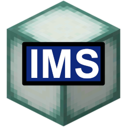

  

# IntegratedMinecraftServer
 The IntegratedMinecraftServer project seeks to provide a reliable, stable interface for managing dedicated Windows Minecraft servers.  IMS runs in the background as a Windows service, manages servers, restarts them upon crashing, provides tools for optimization and management, and includes a remote web interface.  IMS also offers a software development kit for the creation of plugins.
### Included features:
+ Web interface for managing servers, updating their properties, and creating/deleting servers both locally and remotely
+ Ability to password protect the web interface
+ Minecraft: Java Edition and Minecraft: Bedrock Edition support
+ Allows for custom .JAR and .EXE files to be uploaded in order to supported modded Minecraft servers like Bukkit
+ Special text editor for Java server message-of-the-days (MOTDs) that allows for easy formatting of MOTD text as it would appear in Minecraft
+ Supports running multiple servers at once
+ Runs as a Windows service automatically and in the background
+ Restarts servers if they crash
+ Automatic port forwarding available for supported UPnP routers
+ Automatic firewall management for Minecraft servers
+ Integration with the Mojang API for keeping Java servers up-to-date with the latest version
+ Automatic downloading of user-selected Minecraft server versions
+ Player management, including the ability to kick, op, whitelist, and ban players
+ World management, including the ability to generate or upload new Minecraft worlds, create/restore world backups, configure backups to run automatically, and easily switch the world that a server is currently running
+ View Minecraft server consoles and send console commands
+ View Minecraft server logs and configure rules for automatic deletion of server logs
+ Updates itself automatically
+ Extensible API and plugin system
### System requirements:
+ Windows 10 x64
+ At least 200MB of free storage
---
### Installation
The current Windows installer for IMS can be found [here](https://github.com/DouglasDwyer/IntegratedMinecraftServer/releases/tag/v0.2.0.1).  The installer includes all of the files necessary to run IntegratedMinecraftServer, and will prompt to start IMS upon completion.
### Basic usage
#### Server creation
Upon starting IMS for the first time, one will be prompted to create a new server.  There, one may choose what server type, version, and name to use, and may also set certain preferences like how much RAM the server should allocate.  One may click Create to generate and automatically start the new world, or Reset to Default to reset the form to its default settings.
#### Server settings/management
To manage a server or change its preferences, select the lever icon ("Manage servers") on the left navigation bar.  A list of servers will appear on screen.  From there, one may start, restart, or stop any of their servers.  In addition, one may click "Change Settings" to edit the servers' preferences.  Settings like MOTD or default gamemode may be found there.  At any point, if one wishes to change which server they are currently editing, they may select the proper server from the dropdown in the top right corner.  This dropdown may also be used to create new servers.
#### Player management
IMS provides an accessible interface for managing player permissions.  Navigating to the player head icon ("Manage players") on the left navigation bar yields a page which contains a list of the players currently online.  From here, one can change player permissions, turn the server whitelist on/off, ban players and IP addresses, and more.
#### World management
IMS offers complete control over Minecraft worlds.  To access the world management page, click the grass block icon on the left navigation bar.  From there, one can view all current worlds, upload a new world, or force the selected server (indicated by the dropdown in the top right) to generate a new world.  Worlds can be renamed, deleted, and their icons changed.  In addition, clicking on any one world allows one to manage the world's backups, including creating/restoring them, or setting up rules for automatic backup.
#### Server console/logs
If one would like to access the running Minecraft server on a lower level, navigate to the command block on the left navigation bar ("Server console").  From here, one can send commands to the Minecraft server's console interface, or view its logfiles.  Settings for automatic logfile deletion, however, are found in the server settings.
#### Change IMS settings
To report bugs, change the admin console username/password, shut down IMS, or perform other administrative actions, one should click on the book icon ("IMS preferences").  From here, a list of options are available.
